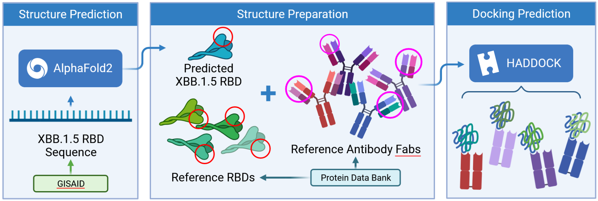

# Predicting changes in neutralizing antibody activity for SARS-CoV-2 XBB.1.5 using _in silico_ protein modeling.

<h4 align="right">Colby T. Ford, Ph.D., Sirish Yasa, Denis Jacob Machado, Ph.D., Richard Allen White III, Ph.D., and Daniel A. Janies, Ph.D. The University of North Carolina at Charlotte</h4>

#### Companion repository for the following articles:
- bior&Chi;iv Preprint: https://www.biorxiv.org/content/10.1101/2023.02.10.528025v1

__Other Media:__
- Inside UNC Charlotte Press Release: https://inside.charlotte.edu/news-features/2023-02-16/advanced-computing-unc-charlotte-indicates-current-antibodies-effective
- Newswise Press Release: https://www.newswise.com/coronavirus/advanced-computing-at-unc-charlotte-indicates-current-antibodies-effective-against-newly-emergent-sars-cov-2-xbb-1-5/?article_id=787137
